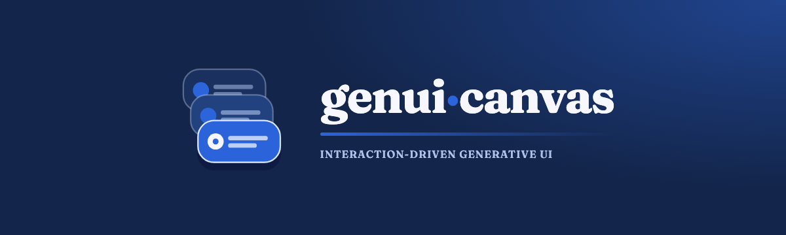

<div align="center">
  
  <br />
  <br />
  
</div>

# genui-canvas

Interaction-driven generative UI for the
[`orca-svg/mcp-gateway-genui`](https://github.com/orca-svg/mcp-gateway-genui)
public-benefit MCP gateway.

The gateway remains deterministic and LLM-free. `genui-canvas` searches its
typed benefit data, lets a provider select from a strict semantic card catalog,
expands the selection into a bounded A2UI message subset, and gives the user
immediate control over the resulting canvas.

> **Current status: fixture-backed research prototype.** The installed
> `@mcp-gen-ui/mcp-server@0.3.0` entry is started in explicit fixture mode for
> deterministic local verification. Results are
> candidates, not eligibility decisions; relative relevance scores are not
> probabilities. Links are labeled official only from the gateway's structured
> exact-origin verification metadata, with health and freshness shown separately.
> Do not use this build for
> production benefit coverage or automated applications.

## Interaction model

- A query submit or persona switch is a **composition point**. The server calls
  the gateway and then the selected rule-based or BYOK provider.
- Pin, hide, expand, reorder (by drag handle or keyboard), and their undo/redo
  are deterministic local operations. They do not call a model or wait for the
  network.
- Manipulation lives on the card. A drag handle (`{title} 순서 바꾸기`)
  reorders candidate rows, and pinned rows move only among pinned rows.
  **더 알아보기** marks a candidate expanded; its `Checklist` and
  `SourceNotice` arrive with the next **조작 반영해 재구성**, and the line
  under its row says so. **고정**, **숨기기**, and **출처** are always
  visible on the card rather than revealed on hover; a pin likewise brings the
  `ScoreBreakdown` with the next recomposition, and that line says so before
  and after the pin. A collapsed `BenefitCard` previews its first
  18rem, which is the title, agency, status, summary, and one score line; the
  score breakdown itself lives only in the `ScoreBreakdown` card. Hiding a row on the card
  or with H leaves an inline **되돌리기** strip for six seconds, and focus
  moves to it so the undo is reachable by keyboard; a hide from the card list
  leaves no strip.
- The canvas uses the full width as one row per candidate: `BenefitCard` first,
  then `ScoreBreakdown`, `Checklist`, and `SourceNotice` in fixed columns so
  candidates line up (two columns between 48rem and 64rem, stacked under
  48rem). `PersonaSelector` is a band on top and `DeadlineList` a band at the
  bottom. A row with nothing composed beside its `BenefitCard` gives the card
  the whole width; empty slots draw nothing, and one quiet line under the row
  says what the next recomposition adds, such as "고정 후 재구성 → 점수 분석".
  When every card is hidden, the canvas says so and points to the card list.
- The top toolbar holds the scenarios, search, **추천 관점**, **실행 취소**,
  **다시 실행**, and **조작 반영해 재구성** with the count of pending
  manipulations (exposed as the button's accessible description,
  "대기 조작 N개").
- The card list is a drawer. Rest the pointer on the right screen edge for
  150ms and it opens (it closes 400ms after the pointer leaves, **열어 두기**
  keeps it open, Esc closes it); the always-visible **카드 목록** handle opens
  it on desktop, and under 48rem the toolbar's **카드 목록** button opens it as
  a bottom sheet. It lists one entry per candidate rather than one per
  sub-card, in canvas order (a hidden row sits where it would reappear),
  jumps to a card, restores hidden rows, and lets you 고정, 숨기기,
  or 위로·아래로 이동 any candidate, which helps when there are many. A
  hover-open leaves keyboard focus where it was, whereas the handle or the
  toolbar button moves focus into the list.
- Keyboard: rows are focusable, and P, H, and E pin, hide, and expand the
  focused row. The typed letter counts, so a Dvorak or AZERTY user presses the
  letter itself; under a Korean input source, where the key types a jamo, the
  physical key stands in. A focused row declares the keys with
  `aria-keyshortcuts`, and the buttons they stand for are always on the card.
  On the handle, Space
  picks a row up, the arrow keys move it, Enter drops it, and Esc cancels,
  with Korean announcements for screen readers.
- Every accepted action is a bounded, structured event, whether it starts on
  the card, in the card list, or at the keyboard. The next composition reads a
  server-derived trace; the client cannot replace that summary.
- Server invariants preserve hidden, pinned, and explicitly reordered cards
  even when a provider ignores the user's manipulation.
- Failed recomposition keeps the previous canvas and records a
  `composition.rejected` event when the trace endpoint remains available.
- Engagement changes what the next composition contains, not only its order:
  an expanded candidate gains its `Checklist` and `SourceNotice`, a pinned
  candidate gains its `ScoreBreakdown`, ticked checklist rows keep the
  `Checklist`, a persona switch puts a `PersonaSelector` first, and dated
  deadlines add a `DeadlineList`. The key-free rule-based provider follows
  exactly these rules, so `pnpm verify` proves them without a model key.
- Checklist ticks are a local preparation memo. They are applied instantly,
  recorded as `checklist.check` / `checklist.uncheck` events carrying only the
  row index, and re-applied on the next composition from the server-derived
  trace, also when a `Checklist` returns after dropping out of a composition.
  They are never an application state.
- A hidden candidate stays in the shell as a hidden row after recomposition,
  so "다시 보기" in the card list works without a round-trip. Compositions
  themselves are not undoable; the undo history restarts at each composition
  point and the status line says so.

The model does not write markup or URLs. It sees only opaque IDs, enums, ranks,
relative scores, allowed component references, and bounded trace flags. Raw
query text, profile strings, benefit titles/summaries, and URLs remain outside
the model instruction channel and are joined after strict validation.

## Trusted semantic catalog

| Component | Trusted gateway result | Purpose |
| --- | --- | --- |
| `BenefitCard` | `searchBenefits` | Candidate summary, status, relative score, reasons, missing information |
| `ScoreBreakdown` | `searchBenefits` | Transparent relative-ranking dimensions |
| `Checklist` | `buildChecklist` | Required/optional preparation items and caveats |
| `DeadlineList` | `getUpcomingDeadlines` | Dated candidate deadlines with uncertainty intact |
| `PersonaSelector` | `listPersonas` | Buttons that switch the visible ranking-weight preset through the normal `persona.switch` composition point; never an eligibility switch |
| `SourceNotice` | `getBenefitDetail` | Source observation, freshness, verified-link health, and user-verification notice |

The deterministic expander emits a bounded A2UI v0.9 basic-catalog subset:
`Card`, `Column`, `Row`, `Divider`, `Text`, plus exactly two interactive
primitives — `Button` whose action must be a named canvas action
(`persona.select` with a gateway persona id) and `CheckBox` bound to a
per-row boolean path. The wire contract rejects any other component, action
name, or literal value before rendering, and all display text is
HTML-escaped. The repository intentionally pins v0.9 because that is what its
installed renderer supports; [A2UI v0.9.1 is the current production
release](https://a2ui.org/), so an upgrade requires an explicit cross-package
protocol test.

## Architecture

```text
apps/web (Vite + React)               apps/server (Hono)
  ├─ toolbar: query, persona, history   ├─ server-issued session / strict event API
  ├─ deterministic shell reducer        ├─ MCP stdio client ─▶ @mcp-gen-ui/mcp-server
  ├─ candidate rows, card list drawer   ├─ strict output cache + semantic projection
  └─ validated SSE/A2UI client ◀────────┤─ rule-based or BYOK Gemini provider
                                        └─ trace store + server-side summarizer

packages/contracts                     packages/renderer
  ├─ strict Zod domain/wire schemas      ├─ A2UI v0.9 processor
  └─ gateway package re-exports          └─ escaped basic-catalog rendering
```

The canvas consumes the gateway's published npm packages; it does not fork or
modify the gateway repository. The original v0.3 producer acceptance handoff is
retained in [`docs/gateway-requirements.md`](docs/gateway-requirements.md).

## Quick start

Requirements: Node.js `>=22.5` and pnpm `10.17.1`.

```bash
pnpm install --frozen-lockfile
pnpm verify
```

`pnpm verify` performs real type/static safety checks, all tests, production
builds, and the deterministic HTTP trace replay. Tests spawn the published
fixture gateway over local MCP stdio; they make no external data request and
need no LLM key.

Run the application in two terminals:

```bash
# Terminal 1 — Hono orchestrator on http://localhost:8787
pnpm --filter @genui-canvas/server dev

# Terminal 2 — Vite SPA on http://localhost:5180
pnpm --filter @genui-canvas/web dev
```

Enter a benefit query or use a sample scenario. Manipulate cards on the canvas,
then select **조작 반영해 재구성** to pass the persisted trace into the next
composition.

After adding or upgrading a dependency, restart the web dev server with
`pnpm --filter @genui-canvas/web exec vite --force`. Otherwise Vite's
mid-session dependency re-optimization can leave two React copies loaded and
log "Invalid hook call".

## Provider configuration (BYOK)

No key is committed or bundled. With no configuration the server uses the
deterministic rule-based provider. To opt into Gemini, copy
`apps/server/.env.example` to the gitignored `apps/server/.env`:

```dotenv
LLM_PROVIDER=gemini
GEMINI_API_KEY=your-own-key
GEMINI_MODEL=gemini-flash-latest
```

A BYOK provider never breaks the canvas. When Gemini throws, exceeds the
12-second timeout, or returns a spec that fails validation, the server logs
the cause and the rule-based provider composes that turn; the composition is
stamped `composedBy: { provider: "rule-based", fallbackFrom: "gemini" }` and
the shell's status line ends with "Gemini 응답을 받지 못해 규칙 기반으로
구성했습니다". `POST /api/session` reports the active provider, the fallback,
the gateway's data mode, and its MCP handshake version, which the notice line
under the toolbar shows instead of assuming fixture data.

The default follows the requested `gemini-flash-latest` alias documented on
[Google's model page](https://ai.google.dev/gemini-api/docs/models). Google
documents that a `latest` alias can move to a stable, preview, or experimental
release. This prototype does not persist Gemini's resolved `modelVersion`, so
controlled-experiment operators must record the resolved version and date
separately.
The Gemini response is still treated as untrusted and must pass the same strict
catalog, reference, and order validation.

## Reproduce the closed loop

```bash
pnpm demo:replay "서울 대학생 지원"
```

The default replay is deterministic and key-free. It passes through actual
Hono session, event, and turn routes, persists this sequence, and checks that
the second provider request received the server-derived summary:

```text
session.start → query.submit → tool.called → composition.applied
→ card.pin → card.hide → card.reorder → card.expand
→ query.submit → tool.called → composition.applied
```

It fails unless the pinned card moves first, the hidden card leaves the
visible order, the order changes, the trace closes the loop, and the second
composition contains `Checklist` and `SourceNotice` for the expanded
candidate and `ScoreBreakdown` for the pinned one (`subCardsComposed`).
`groupedOrderPreserved` checks the candidate-group layout of *both*
compositions, not only the second: each candidate's cards stay together in
the fixed `BenefitCard → ScoreBreakdown → Checklist → SourceNotice` order,
with pinned groups first — the control composition (nothing pinned yet) and
the manipulated one (the pinned entity) each have to hold that shape. A
pinned `DeadlineList` staying present yet still last isn't something this
replay exercises (the fixture never pins it); `enforce.test.ts`'s "keeps a
pinned DeadlineList present but still last even though the provider led
with it" and "restores a pinned DeadlineList the provider omitted entirely,
placing it last" cover that case. To investigate a locally configured model
separately (not a CI/reproduction gate):

```bash
pnpm --filter @genui-canvas/server demo:replay:live -- "서울 대학생 지원"
```

## Privacy and safety boundary

- Session IDs are server-issued UUIDs; path traversal, unknown sessions,
  sequence gaps, and different duplicate events are rejected.
- An exact retry of a client event is idempotent only while that event is
  still the session's latest row, supporting response-loss recovery without
  duplicate trace rows. A turn's `tool.called` row ends that window: once it
  lands, the client's next event gets a sequence-conflict reply carrying the
  server's `nextSeq`, and the client rebuilds that event with it and retries
  once.
- The server records `session.start` and one `tool.called` ledger per turn
  (tool name, call and failure counts only) in the same trace, and returns
  `nextSeq` so the client cannot skip or reuse a sequence number.
- Only `query.submit.text` may contain user-authored free text, bounded to 300
  characters. Other event payloads are type-specific and strict. Do not enter
  personal identifiers in a query.
- Unknown profile fields are rejected; the schema has no name, resident number,
  email, phone, detailed address, credential, login, or submission field.
- Local traces default to `apps/server/data/sessions` and are gitignored. The
  application performs no login, identity verification, or application submit.
- CORS is an explicit allowlist; internal provider errors and rejected model
  output are not returned to the browser.
- HTTPS source links are opened by the user in a new tab with opener isolation.

## Verification and research claims

- [`docs/verification.md`](docs/verification.md) — executable gates, test layers,
  browser checks, and known limitations.
- [`docs/research-grounding.md`](docs/research-grounding.md) — primary research,
  implementation mapping, and claim boundaries. The requested venue gist is
  used only as a secondary filter, not as evidence.
- [`docs/gateway-requirements.md`](docs/gateway-requirements.md) — P0/P1/P2
  gateway contracts and acceptance tests for the other repository's developer.

## License

[Apache-2.0](LICENSE)
